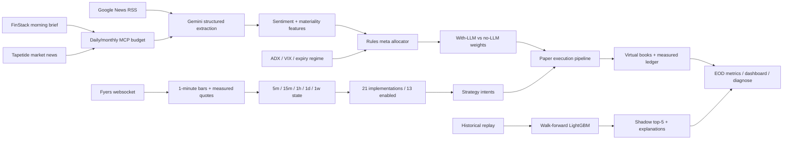

# StratFirst AI (`nse-trader`)

**A strategy-first research lab for testing whether bounded AI and ML can improve capital allocation across established NSE trading strategies—before any model is trusted with real money.**

> Built for the Razorpay AI Buildathon Open Track. This is a local **paper-trading research system**. It never places live broker orders and does not promise investment returns.

## The pitch

Most “AI trading” projects ask a model to discover trades or weight stocks directly. That creates an uncomfortable problem for a non-expert: when the model loses money, it is difficult to tell whether the strategy, data, execution assumptions, or model was wrong.

StratFirst AI reverses that workflow:

1. Start with interpretable, established systematic strategy families.
2. Run every implementation through the same realistic paper-execution pipeline.
3. Disable sleeves whose observed behaviour is unsafe or unconvincing.
4. Let AI and ML **rank or tilt capital**, not invent unchecked trades.
5. Keep new models in shadow until forward evidence justifies promotion.

The research question is deliberately narrower than “Can AI beat the market?”:

> **Can a person with limited quantitative experience operate an explainable, multi-strategy research process—and can a gated AI/ML allocator improve its decisions over simple baselines?**

## What is working

- **21 strategy implementations** across trend, mean-reversion, cross-sectional, volatility, intraday, calendar, and defensive families.
- **13 strategies currently enabled**; eight are intentionally parked after implementation or paper evidence raised concerns.
- Fyers websocket ingest, one-minute bars, multi-timeframe strategy evaluation, measured bid/ask friction, fees, circuit handling, and MIS/CNC product rules.
- A deterministic rules allocator using regime information plus a bounded Gemini news tilt.
- A LightGBM top-five strategy selector trained with expanding walk-forward folds and an embargo, running **shadow-only**.
- Daily counterfactual weights: `weights` versus `weights_no_llm`, so the news contribution is observable.
- Automated morning enrichment, market ingest, paper execution, EOD measurement, dashboard generation, and runtime diagnostics.
- Approximately 300 automated tests across strategy contracts, replay parity, execution safety, ML data flow, and operational recovery.

## Why “strategy-first” matters

The strategies remain ordinary, inspectable Python rules. Gemini does not generate orders, and LightGBM does not control the live paper book. The AI layer is intentionally narrow:

| Layer | Responsibility | Safety boundary |
|---|---|---|
| Strategy rules | Produce BUY, SELL, FLAT, or HOLD intents | No LLM-generated trades |
| Gemini | Compress headlines into sentiment, materiality, and events | Failure becomes neutral features |
| FinStack + Tapetide | Add market-wide morning context | Maximum 2 calls/day and 40/month |
| Rules meta allocator | Apply interpretable regime and news tilts | Constraints cap strategy/cluster exposure |
| LightGBM | Rank likely next-day top-five strategies | Shadow-only; cannot move paper capital |
| Simulator | Apply exchange, fee, spread, circuit, and product rules | Paper fills only; no broker-order API |

This separation makes a negative result useful: a model that looks intelligent but fails economic validation is prevented from reaching capital.

## Architecture



## Evidence so far

The latest frozen offline artifacts report:

| Measurement | Result |
|---|---:|
| Historical sessions | 737 |
| Walk-forward folds | 33 |
| Mean fold AUC | 0.629 |
| Mean top-five precision | 0.596 |
| Out-of-fold policy days | 694 |
| Probability model top-five beats random-one | 0.593 |
| Hit rate versus equal-all | 0.772 |
| Model top-five CAGR / max drawdown / Sharpe | +1.38% / −12.24% / 0.22 |
| Nifty 50 benchmark CAGR / max drawdown / Sharpe | +12.86% / −19.01% / 0.92 |

These results **do not establish profitable alpha**. The model reduced drawdown relative to the benchmark but substantially underperformed its return and Sharpe. Forward measurements currently cover only a few sparse sessions, so LightGBM remains shadow-only. That refusal to promote weak evidence is part of the product, not a hidden failure.

See `docs/paper/limitations-and-methods.md` and [`docs/results/RESULTS.md`](docs/results/RESULTS.md) for assumptions and threats to validity.

## Judge-safe local demo

Python 3.12 is recommended. Prefer [uv](https://docs.astral.sh/uv/) for a fast clean install:

```bash
git clone <public-repository-url>
cd nse-trader   # or stratfirst-ai
uv sync
source .venv/bin/activate
python main.py refresh-fees --offline

# No broker or AI credentials required
python main.py test
python main.py demo
```

Fallback without uv:

```bash
python -m venv .venv && source .venv/bin/activate
pip install -r requirements.txt
```

Open `data/demo/dashboard.html` after `demo`. Public metrics and a safe visual:
[`docs/results/RESULTS.md`](docs/results/RESULTS.md),
[`docs/results/demo-dashboard.svg`](docs/results/demo-dashboard.svg).
Application packet: [`SUBMISSION.md`](SUBMISSION.md).

Synthetic demo figures are **not** investment evidence. LightGBM stays shadow-only.

## Live paper workflow

Live quotes and Gemini are optional enhancements, not requirements for inspecting the code.

```bash
cp .env.example .env
# Fill only the integrations you intend to use.

python main.py fyers-login --url-only
python main.py fyers-login --auth-code '<redirect-or-code>'
python main.py llm-extract --slot morning
python main.py paper --mode ingest
python main.py eod
python main.py meta-status
python main.py diagnose --json
```

User-level systemd timers provide the unattended weekday loop:

| Time (IST) | Job |
|---|---|
| 08:30 | Refresh/remint Fyers access |
| 08:40 | Budgeted market enrichment → Gemini features |
| 09:10–15:35 | Closed-bar ingest and paper evaluation |
| 15:20 | Backup MIS square-off |
| 15:45 | EOD reconciliation, metrics, health, and dashboard |

Enable the local timers with:

```bash
./deploy/enable-user-timers.sh
systemctl --user list-timers 'nse-trader*'
```

## Safety and failure recovery

- No live order-placement code path.
- Placeholder quotes can test ingestion but are never allowed to drive paper-live fills.
- Missing or crossed bid/ask quotes cause skips, not invented slippage.
- MIS shorts are allowed only intraday; CNC remains long-only.
- Strategy-owned flattening runs before the broker-style backup square-off.
- Circuit-locked exits may be rejected rather than filled unrealistically.
- Gemini failures fall back to neutral structured features.
- MCP calls are budgeted and fail soft to RSS-only extraction.
- The LightGBM allocator cannot control capital while in shadow mode.
- `diagnose` inspects timers, EOD artifacts, logs, and historical service failures.

The detailed engineering story—including failures that initially produced misleading or unsafe behaviour—is in [`docs/FAILURE_RECOVERY.md`](docs/FAILURE_RECOVERY.md).

## Repository map

| Path | Purpose |
|---|---|
| `strategies/` | Strategy contracts and clusters A–G |
| `data/` | Ingest, storage, resampling, and local runtime artifacts |
| `sim/` | Exchange checks, fees, friction, broker, and portfolio simulation |
| `features/` | Bar state, cross-sectional ranks, Gemini, and MCP enrichment |
| `meta/` | Rules allocator, regime features, LightGBM train/shadow paths |
| `experiments/` | Replay, paper-live, bake-off, measurement, and EOD |
| `ops/` | Dashboard, health checks, and diagnostics |
| `deploy/systemd/` | User-level unattended scheduling |
| `tests/` | Unit, integration, parity, and runtime tests |

## Current limitations

- This is paper simulation, not evidence of executable live alpha.
- The Nifty 50 universe introduces survivorship and membership-change risk.
- Replay labels include fee-table costs but not complete historical bid/ask spreads.
- Cross-sectional strategy replay is approximate rather than a true simultaneous long/short portfolio.
- Some regime and ranking features still use documented proxies.
- The LLM tilt has counterfactual weight evidence, not enough P&L history to claim economic uplift.
- External data providers can be stale, unavailable, quota-limited, or inconsistent.

## Future plan (gated — not a live-trading roadmap yet)

**Status today:** local paper research only. Exchange/product/fee checks in the simulator (including SEBI-relevant market-structure constraints such as circuits, product type, and settlement-style behaviour) make paper fills *more honest*. They do **not** make the system ready to place real orders.

### Public glance vs live EOD data

GitHub Pages is a good fit for a **judge-safe static glance** (demo HTML, RESULTS, architecture SVG) — not for the live Tailscale dashboard that may carry host IPs or local paths.

Ways to refresh Pages after EOD without leaking runtime state:

| Approach | Pros | Cons |
|---|---|---|
| **A. Static only** | Zero leak risk; `docs/results/` + `main.py demo` artifacts | Manual refresh when you want new numbers |
| **B. Scheduled Actions** | EOD (or nightly) job builds a **redacted** JSON/HTML and deploys to `gh-pages` | Needs a public-safe export schema; no tokens in artifacts |
| **C. Push from local EOD** | Uses your already-running timers | Easy to over-share; keep a hard allowlist of fields |

Recommended default: **A now**, **B later** once a `docs/results/public_glance.json` schema exists (dates, sleeve metrics, shadow top-5, dual-weight L1 — never books, fills, tokens, or absolute paths). Live paper ops stay on the local/Tailscale dashboard.

Promotion gates before any broker write path is even designed:

| Gate | Exit criterion |
|---|---|
| G0 Paper fidelity | ≥60 consecutive sessions with diagnose green; no placeholder-driven fills |
| G1 Economic edge | Rules book and/or shadow ML beat agreed baselines **after** fees+spreads on a pre-registered forward window |
| G2 Stability | Max drawdown, turnover, and kill-switch behaviour within stated bounds; dual LLM dump shows no silent regime break |
| G3 Ops maturity | Token remint, timer failure recovery, and dashboard triage documented with drills |
| G4 Human oversight | Written kill criteria, position limits, and a human-in-the-loop approve step — still paper capital |
| G5 Broker sandbox | Read-only broker APIs first; then a separate, tiny notional sandbox with hard kill — **only after G0–G4** |

Near-term engineering (still paper):

1. Lock dependency installs with `uv.lock` and keep CI on `uv sync`.
2. Lengthen forward bake-off until `sparse: false`; publish updated RESULTS only with dates and sample sizes.
3. True cross-sectional portfolio replay (simultaneous long/short with shared capital).
4. Historical bid/ask or conservative spread model in Cat-1 labels (close the fee-only gap).
5. Optional: promote LightGBM from shadow → advisory weights only after G1; never skip shadow.
6. Compliance checklist as a first-class artifact (disclosure, audit log, no advice claims) — still not a go-live.

**Explicit non-goals for this phase:** live order placement, leveraged products beyond current MIS/CNC paper rules, unsupervised LLM trade generation, or marketing “proven profitable” claims.

## Further reading

- [`SUBMISSION.md`](SUBMISSION.md) — Buildathon application packet
- [`docs/results/RESULTS.md`](docs/results/RESULTS.md) — public redacted metrics
- [`docs/FAILURE_RECOVERY.md`](docs/FAILURE_RECOVERY.md) — what broke and how it was fixed
- [`docs/paper/limitations-and-methods.md`](docs/paper/limitations-and-methods.md) — methods, results, and claim boundaries
- [`docs/strategy-audit-matrix.md`](docs/strategy-audit-matrix.md) — strategy contracts and implementation audit
- [`PUBLIC_RELEASE_CHECKLIST.md`](PUBLIC_RELEASE_CHECKLIST.md) — public-release checklist
- [`LICENSE`](LICENSE) — MIT

